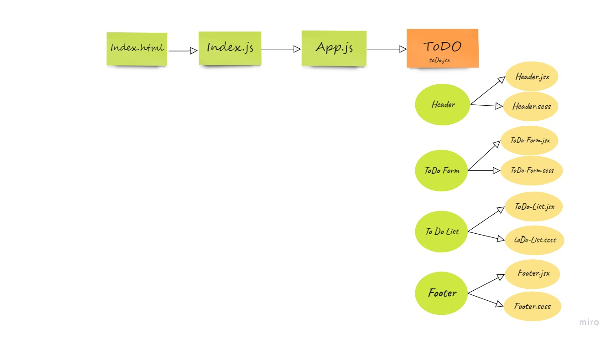

# To-Do-App

A cloud-based task management application, allows users to manage their tasks.

* [Deployment](https://to-do-react-app-1.netlify.app/)  
* [Pull Request](https://github.com/En-ZUH/To-do-app/pulls)

[Deploy 1st- branch- lab 32](https://todo-react-app-1st-branch.netlify.app/)
## Running the app

 `npm start`

## UML-Diagram

